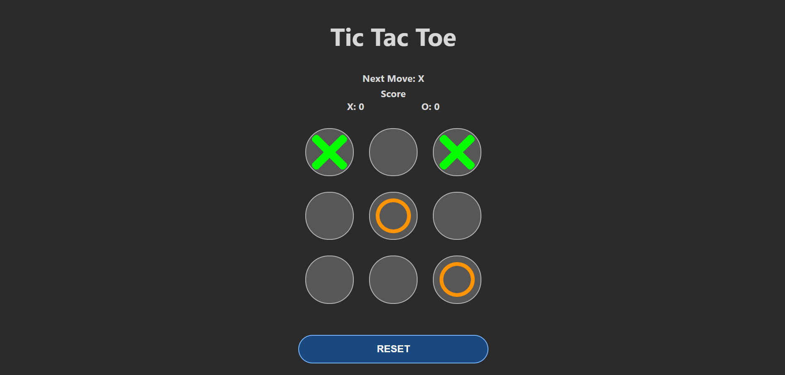
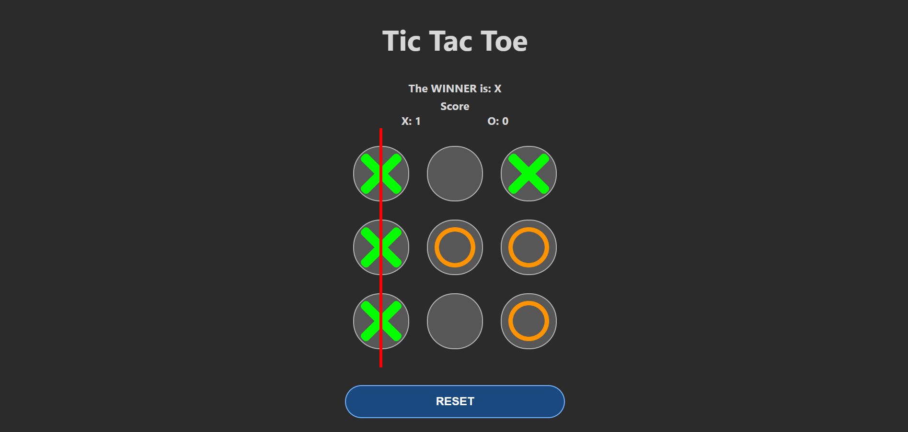
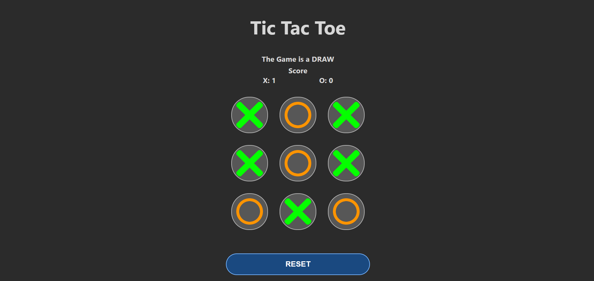

# Tic Tac Toe Game

This project is a simple implementation of the classic Tic Tac Toe game using React.

## Features

- Play Tic Tac Toe against another player.
- Track scores for both X and O.
- Reset the game board at any time.

## Screenshots





## Technologies Used

- React
- CSS

## Installation

1. Clone the repository:

   ```bash
   git clone https://github.com/The-CuriousOne/tic-tac-toe.git
